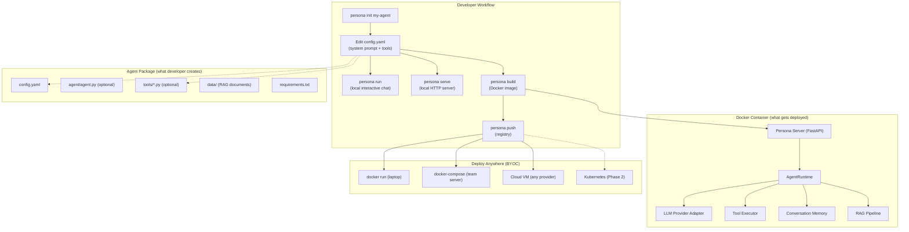
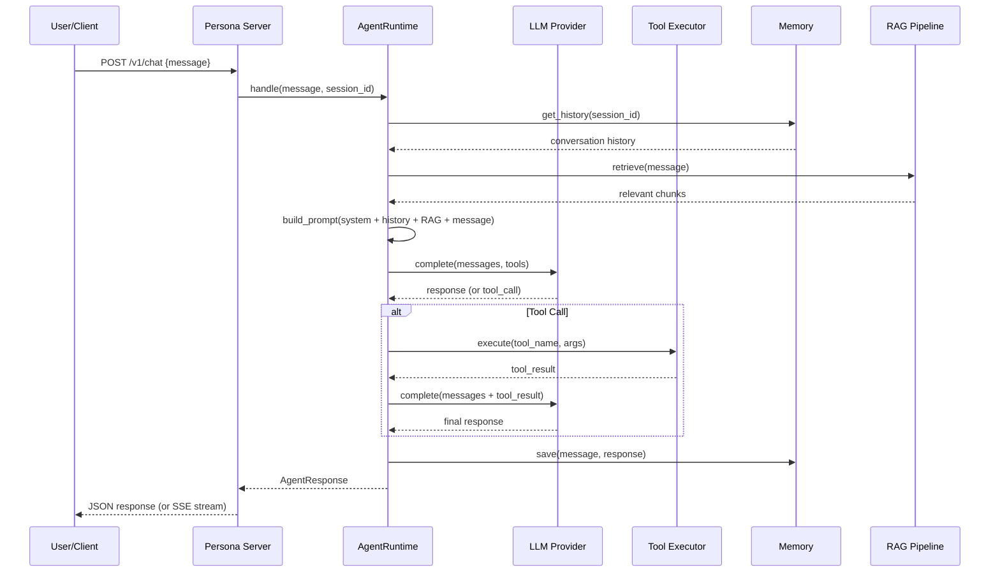
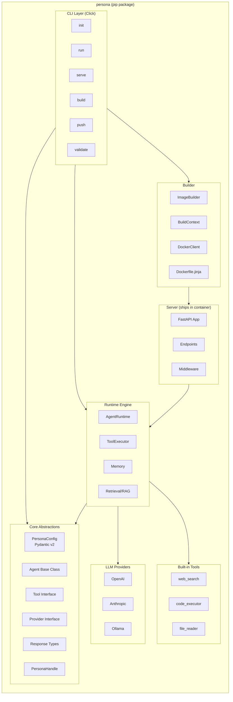
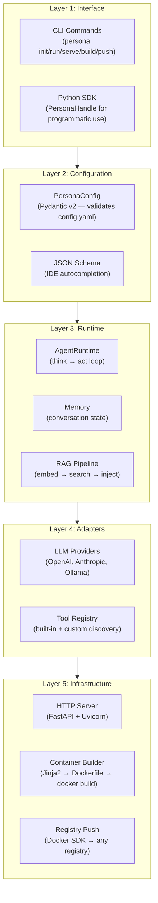
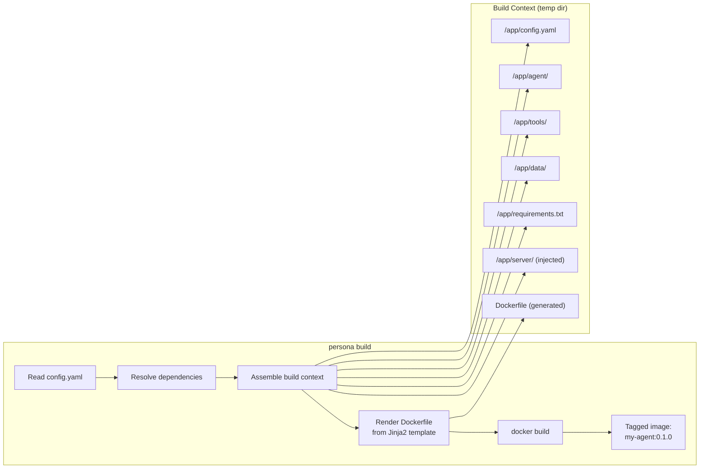

# Persona Framework — Phase 1 Architecture

## Vision

Persona is an open-source Python framework that lets developers **define AI agents in YAML** and **deploy them anywhere as Docker containers**. Inspired by Baseten's Truss (which packages ML models), Persona packages **agentic AI** — agents that reason, use tools, and answer questions.

**Phase 1 Goal:** Free local tool. Developer defines agent → runs locally → builds Docker image → deploys to any Docker host. No vendor lock-in. No cloud dependency.

---

## High-Level Architecture



---

## Core Abstractions

### 1. Agent Package (The "Persona")

A self-contained directory — the unit of packaging. Everything needed to run an agent lives here.

```
my-agent/
├── config.yaml             ← The contract (defines what the agent IS)
├── agent/
│   └── agent.py            ← Custom logic (optional — only if YAML isn't enough)
├── tools/
│   └── my_tool.py          ← Custom tool implementations
├── data/                   ← Bundled files (RAG docs, lookup tables)
├── packages/               ← Bundled local Python packages
├── requirements.txt        ← Python dependencies
└── .personaignore          ← Exclude from Docker build context
```

### 2. config.yaml (The Declaration)

The single source of truth. For simple agents, this is the ONLY file a developer writes.

```yaml
name: support-agent
version: "0.1.0"
description: "Customer support agent for Acme Corp"

agent:
  system_prompt: |
    You are a customer support agent for Acme Corp.
    Be helpful, concise, and professional.
    Always check the knowledge base before answering.
  model:
    provider: openai
    name: gpt-4o
    parameters:
      temperature: 0.3
      max_tokens: 2048
  tools:
    - name: web_search
      type: builtin
    - name: ticket_lookup
      type: custom
      module: tools.ticket_lookup
      class: TicketLookup
  retrieval:
    enabled: true
    data_dir: data/
    chunk_size: 512
    embeddings:
      provider: openai
      model: text-embedding-3-small

runtime:
  concurrency: 4
  timeout_seconds: 120
  streaming: true

resources:
  cpu: "2"
  memory: "4Gi"

python_version: "3.11"
secrets:
  - OPENAI_API_KEY
  - ACME_API_KEY
```

### 3. Agent Runtime (The Engine)

The core execution loop that turns config + user message into agent responses:



---

## System Components

### Component Diagram



---

## Layer Architecture



Each layer only depends on layers below it. No circular dependencies.

---

## Data Flow

### Local Development (`persona run`)

```
┌──────────────┐     ┌──────────────────┐     ┌─────────────────┐
│   Terminal    │────▶│   AgentRuntime   │────▶│   LLM Provider  │
│  (readline)  │◀────│   (in-process)   │◀────│   (API call)    │
└──────────────┘     └──────────────────┘     └─────────────────┘
                              │
                              ▼
                     ┌──────────────────┐
                     │   Tool Executor  │
                     │   (subprocess)   │
                     └──────────────────┘
```

### Deployed Container (`docker run`)

```
┌──────────────┐     ┌──────────────────┐     ┌─────────────────┐
│   Client     │────▶│   FastAPI Server │────▶│   AgentRuntime   │
│  (HTTP/SSE)  │◀────│   (Uvicorn)      │◀────│   (same engine)  │
└──────────────┘     └──────────────────┘     └─────────────────┘
                                                       │
                                               ┌───────┼───────┐
                                               ▼       ▼       ▼
                                           Provider  Tools    RAG
```

**Key insight:** The same `AgentRuntime` runs in both modes. The CLI wraps it in a readline loop; the server wraps it in HTTP endpoints. The agent doesn't know or care which mode it's in.

---

## Containerization Pipeline



### Generated Dockerfile (conceptual)

```dockerfile
FROM python:3.11-slim

# System packages
RUN apt-get update && apt-get install -y <system_packages>

# Install framework server dependencies
COPY server-requirements.txt /tmp/
RUN pip install -r /tmp/server-requirements.txt

# Install user dependencies
COPY requirements.txt /app/
RUN pip install -r /app/requirements.txt

# Copy agent code + server
COPY . /app/
WORKDIR /app

# Health check
HEALTHCHECK --interval=30s CMD curl -f http://localhost:8080/health

EXPOSE 8080
CMD ["uvicorn", "persona.server.main:app", "--host", "0.0.0.0", "--port", "8080"]
```

---

## API Contract (Container HTTP Interface)

Every Persona container exposes the same standard API:

| Endpoint         | Method | Purpose                                                 |
| ---------------- | ------ | ------------------------------------------------------- |
| `/v1/chat`       | POST   | Send message, receive response (JSON or SSE stream)     |
| `/health`        | GET    | Liveness probe (always 200 if process is running)       |
| `/ready`         | GET    | Readiness probe (200 only after agent.load() completes) |
| `/v1/agent/info` | GET    | Agent metadata (name, version, tools, capabilities)     |

### Request/Response Schema

```json
// POST /v1/chat
// Request:
{
  "message": "What's the status of ticket #12345?",
  "session_id": "optional-session-uuid",
  "stream": false
}

// Response (non-streaming):
{
  "response": "Ticket #12345 is currently open...",
  "session_id": "uuid",
  "tool_calls": [
    {"tool": "ticket_lookup", "input": {"id": "12345"}, "output": "..."}
  ],
  "usage": {"prompt_tokens": 450, "completion_tokens": 120}
}

// Response (streaming): Server-Sent Events
// data: {"type": "token", "content": "Ticket"}
// data: {"type": "token", "content": " #12345"}
// data: {"type": "tool_call", "tool": "ticket_lookup", "status": "executing"}
// data: {"type": "tool_result", "tool": "ticket_lookup", "output": "..."}
// data: {"type": "token", "content": " is currently open..."}
// data: {"type": "done", "usage": {...}}
```

---

## Security Model

### Secrets Management

- Secrets declared in `config.yaml` under `secrets:` (just the key names)
- **Never baked into Docker image**
- Passed at runtime via environment variables: `docker run -e OPENAI_API_KEY=sk-...`
- Server validates all declared secrets exist at startup (fail-fast)

### Tool Sandboxing (Phase 1)

- `code_executor` tool runs in a subprocess with:
  - Timeout (configurable, default 30s)
  - No network access (optional)
  - Memory limit via resource module
- Custom tools run in-process (trusted code — developer wrote them)

### Container Security

- Non-root user inside container
- Read-only filesystem (except `/tmp`)
- No capabilities beyond minimum required
- Health endpoints don't expose sensitive info

---

## Extension Points

### Custom Agent Class (Override Default Behavior)

```python
# agent/agent.py
from persona.core.agent import Agent, AgentResponse, ConversationContext

class MyAgent(Agent):
    def load(self):
        """Called once at startup. Load custom resources."""
        self.db = connect_to_database(self.secrets["DB_URL"])

    async def handle(self, message: str, context: ConversationContext) -> AgentResponse:
        """Full override of the think→act loop."""
        # Custom routing, multi-step reasoning, etc.
        ...
```

### Custom Tools

```python
# tools/ticket_lookup.py
from persona.core.tool import Tool, ToolResult

class TicketLookup(Tool):
    name = "ticket_lookup"
    description = "Look up a support ticket by ID"
    parameters = {
        "type": "object",
        "properties": {
            "ticket_id": {"type": "string", "description": "The ticket ID"}
        },
        "required": ["ticket_id"]
    }

    async def execute(self, ticket_id: str) -> ToolResult:
        # Call your ticketing API
        result = await self.http_client.get(f"/tickets/{ticket_id}")
        return ToolResult(output=result.json())
```

### Custom LLM Provider

```python
# Register via entry points or config
from persona.core.provider import LLMProvider, LLMResponse

class MyProvider(LLMProvider):
    async def complete(self, messages, tools=None) -> LLMResponse:
        # Call your custom model endpoint
        ...
```

---

## Technology Choices

| Component             | Technology              | Rationale                                             |
| --------------------- | ----------------------- | ----------------------------------------------------- |
| Config validation     | Pydantic v2             | Fast, generates JSON Schema for IDE support           |
| CLI                   | Click                   | Composable, well-tested, standard for Python CLIs     |
| HTTP Server           | FastAPI + Uvicorn       | Async, auto-docs, streaming support, production-ready |
| Dockerfile generation | Jinja2                  | Same approach as Truss, flexible templating           |
| Container build/push  | Docker SDK for Python   | Programmatic control, no shell dependency             |
| LLM calls             | openai / anthropic SDKs | Official, well-maintained, async support              |
| Output formatting     | Rich                    | Beautiful terminal output for `persona run`           |
| Config parsing        | PyYAML                  | Standard, fast, universal                             |
| Vector store (RAG)    | ChromaDB (in-process)   | Zero infrastructure, embeds in single container       |

---

## What Phase 1 Does NOT Include

| Concern                       | Phase 1                                   | Future Phase                        |
| ----------------------------- | ----------------------------------------- | ----------------------------------- |
| Multi-container orchestration | Single container only                     | Phase 2: Kubernetes Helm charts     |
| Autoscaling                   | Manual `docker run` replicas              | Phase 2: Managed platform           |
| Persistent memory             | In-process (lost on restart)              | Phase 2: Redis/Postgres adapter     |
| Authentication                | None (trust network boundary)             | Phase 2: API key / OAuth middleware |
| Observability                 | stdout logging                            | Phase 2: OpenTelemetry export       |
| Multi-agent orchestration     | Config schema defined, `single` mode only | Phase 1.5: `router` mode            |
| WebSocket transport           | HTTP + SSE only                           | Phase 2                             |
| GPU support                   | CPU-only containers                       | Phase 2: CUDA base images           |

---

## Project Source Layout

```
persona/                              # Repository root
├── pyproject.toml                    # Package: dependencies, CLI entry point, metadata
├── README.md                         # Quickstart guide
├── LICENSE                           # Apache 2.0
│
├── persona/                          # Python package
│   ├── __init__.py                   # version, public exports
│   │
│   ├── cli/                          # CLI commands (Click)
│   │   ├── __init__.py
│   │   ├── main.py                   # Entry: persona → click group
│   │   ├── init_cmd.py              # persona init
│   │   ├── run_cmd.py              # persona run (interactive)
│   │   ├── serve_cmd.py            # persona serve (HTTP)
│   │   ├── build_cmd.py            # persona build (Docker)
│   │   ├── push_cmd.py             # persona push (registry)
│   │   └── validate_cmd.py         # persona validate
│   │
│   ├── core/                         # Interfaces + types
│   │   ├── config.py                # PersonaConfig (Pydantic)
│   │   ├── agent.py                 # Agent ABC
│   │   ├── tool.py                  # Tool ABC + ToolResult
│   │   ├── provider.py             # LLMProvider ABC
│   │   ├── response.py             # AgentResponse, StreamChunk
│   │   └── handle.py               # PersonaHandle (programmatic)
│   │
│   ├── runtime/                      # Execution engine
│   │   ├── agent_runtime.py         # Think→Act loop
│   │   ├── tool_executor.py         # Safe tool dispatch
│   │   ├── memory.py               # In-process conversation memory
│   │   └── retrieval.py            # RAG: chunk → embed → search
│   │
│   ├── providers/                    # LLM adapters
│   │   ├── base.py                  # Shared utilities
│   │   ├── openai_provider.py
│   │   ├── anthropic_provider.py
│   │   ├── ollama_provider.py
│   │   └── registry.py             # Provider lookup
│   │
│   ├── tools/                        # Built-in tools
│   │   ├── base.py
│   │   ├── web_search.py
│   │   ├── code_executor.py
│   │   ├── file_reader.py
│   │   └── registry.py             # Tool discovery
│   │
│   ├── server/                       # HTTP layer (copied into container)
│   │   ├── app.py                   # FastAPI factory
│   │   ├── endpoints.py            # /v1/chat, /health, /ready
│   │   ├── middleware.py           # CORS, error handling
│   │   └── main.py                 # uvicorn entry (Docker CMD)
│   │
│   ├── builder/                      # Docker build pipeline
│   │   ├── image_builder.py         # Build orchestration
│   │   ├── context.py              # Assemble build dir
│   │   ├── docker_client.py        # Docker SDK wrapper
│   │   └── templates/
│   │       ├── Dockerfile.jinja
│   │       └── entrypoint.sh.jinja
│   │
│   └── templates/                    # Scaffolding for `persona init`
│       └── default/
│           ├── config.yaml
│           ├── agent/agent.py
│           ├── tools/example_tool.py
│           ├── data/.gitkeep
│           └── requirements.txt
│
├── tests/
│   ├── test_config.py
│   ├── test_runtime.py
│   ├── test_builder.py
│   └── test_cli.py
│
└── docs/
    └── architecture.md               # This file
```

---

## Summary

Persona Phase 1 delivers a **complete local-first agent development kit**:

1. **Define** → `config.yaml` (zero-code for simple agents)
2. **Develop** → `persona run` (interactive testing)
3. **Package** → `persona build` (Docker image with embedded server)
4. **Deploy** → `docker run` anywhere (BYOC — your hardware, your cloud, your rules)

The framework handles all complexity: LLM wiring, tool execution, streaming, containerization, dependency management. The developer focuses purely on **what the agent should do**.
